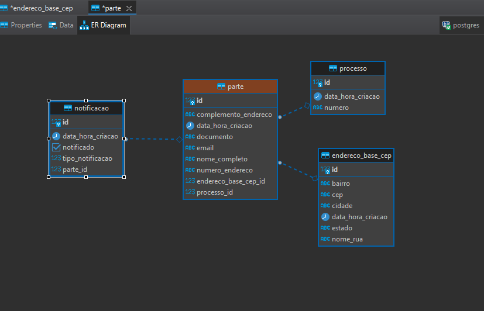

# NOTIFICADOR PJE

Missão de certificação do Mundo 3 da Universidade Estácio.

✨ Vide documentação SwaggerUI ao subir a aplicação em http://localhost:8080/ ✨

### Fluxo simplificado e exemplificativo de uso da API:

- CONFIGURAÇÕES INICIAIS

application.yml

```
spring:
    datasource:
    url: jdbc:postgresql://???????????????????
    username: ???????
    password: ???????
```

- PARTES

Nos endpoints de Parte, faça o cadastro/inclusão/exclusão/alteração da parte.

- PROCESSO JUDICIAL E VINCULAR PARTES

Nos endpoints de Processo, faça o cadastro/inclusão/exclusão/alteração do processo. Utilize o endpoint `/{id}/adicionar-parte/` para associar a parte ao seu respectivo processo, utilizando o ID do processo e um lista de IDs de partes.

- NOTIFICAÇÕES

Nos endpoints de Notificação, faça o cadastro e visualização das notificações. Utilize o endpoint `/notificar-processo/{processoId}` para registrar solicitação de notificação para todas as partes de um processo, utilizando o ID do processo cadastrado previamente no sistema.

Utilize os endpoint `/notificar-e-carta` e `/notificar-dje` para consultar as notificações pendentes e regitrar no sistema seu respectivo processamento pelo E-Carta e pelo DJE.

Utilize os endpoints `/ecarta` e `/dje` apenas para visualizar, sem registrar o processamento, as notificações do E-cartas e DJE pendentes.

### UML


